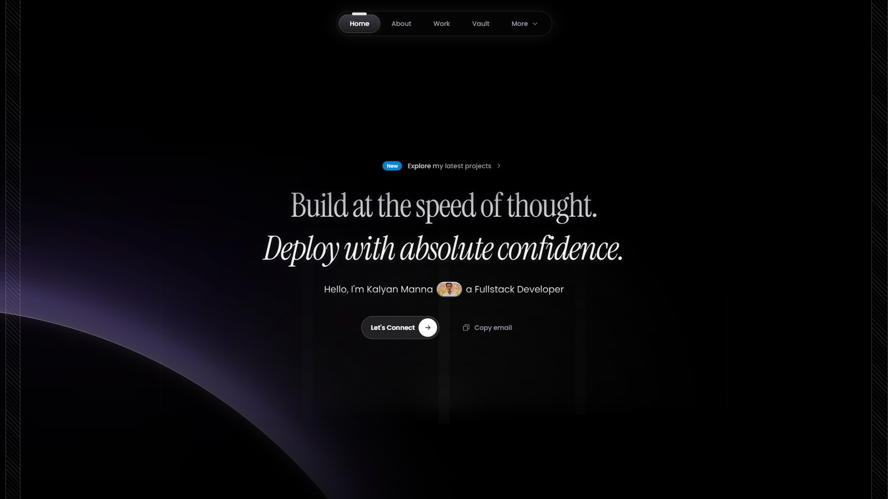
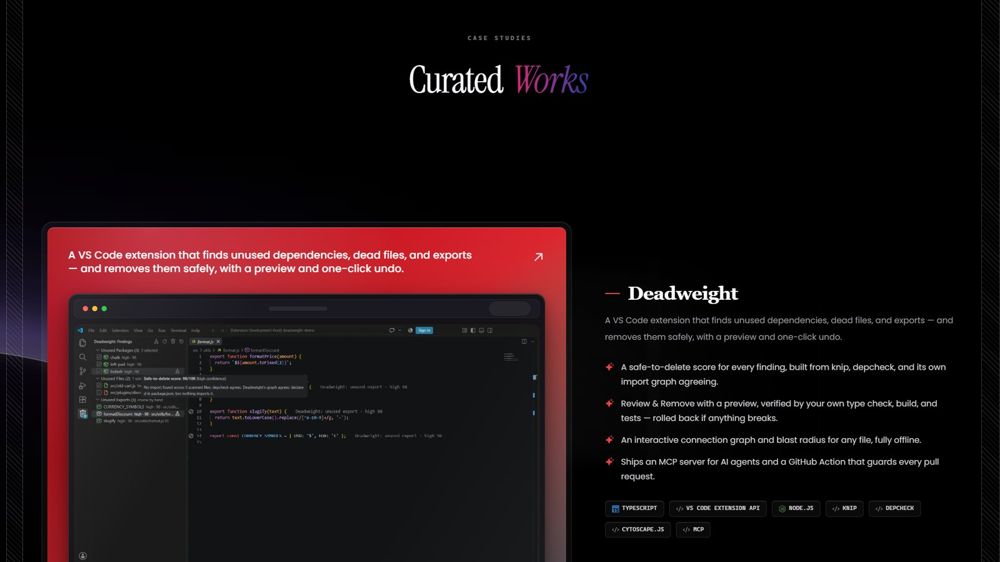
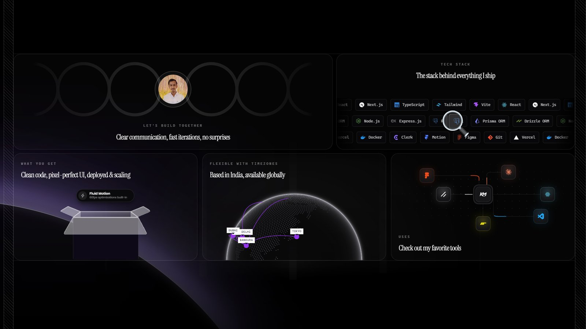
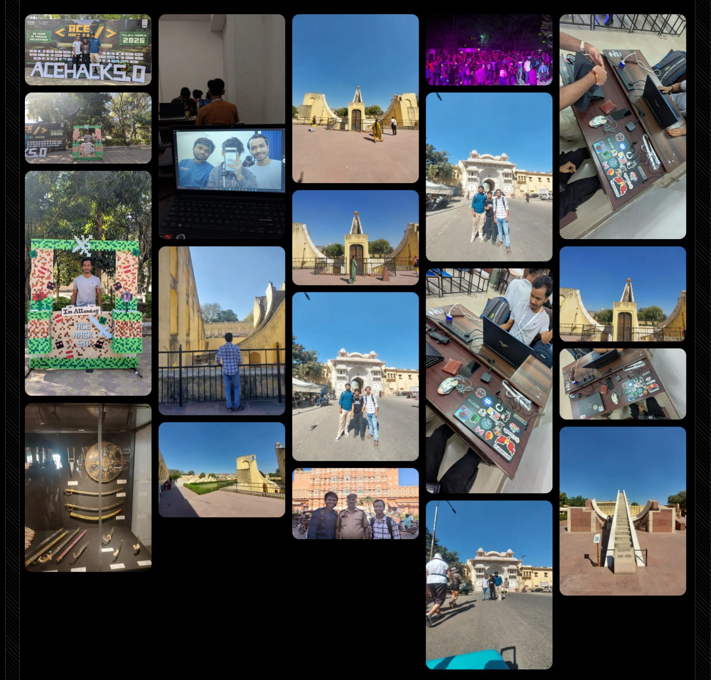
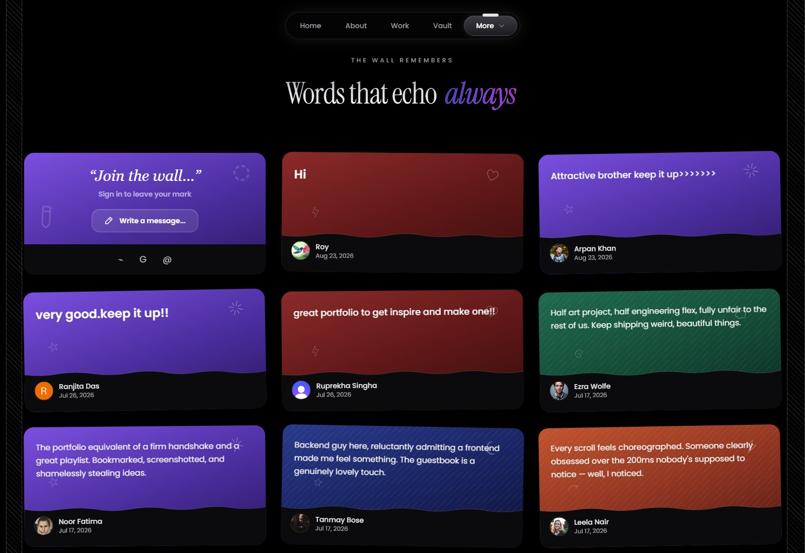

<div align="center">

# Hi, I'm Kalyan Manna 👋

**Full-stack developer & freelancer from Kharagpur, India**

I build fast, modern, and scalable websites, web apps, mobile apps, and digital products.

[**kalyanmanna.com**](https://www.kalyanmanna.com) · [LinkedIn](https://www.linkedin.com/in/kalyan-manna) · [X](https://x.com/Kalyan_Manna_4) · [Book a call](https://cal.com/kalyanmanna) · [Email](mailto:kalyanmanna439@gmail.com)

</div>

<br />

<a href="https://www.kalyanmanna.com">
  
</a>

## About me

I'm a full-stack developer, freelancer and problem solver. I care about the whole
product, from clean architecture and maintainable code on the backend to
interfaces that feel fast, polished and intuitive.

I work mostly across the TypeScript ecosystem: React and Next.js on the web, Expo
for mobile, and Node.js with PostgreSQL behind them. Lately I've been building
developer tools too.

Outside client work you'll find me at hackathons and community meetups like
HackRIT, AceHack and React Kolkata, building under pressure and meeting people
worth knowing.

> **Open to work:** I'm available for full-time roles and freelance projects.
> [Let's talk](https://www.kalyanmanna.com/contact).

## What I've built

| Project | What it is |
| --- | --- |
| [**Deadweight**](https://marketplace.visualstudio.com/items?itemName=kalyanmanna.deadweight) | A VS Code extension that finds unused dependencies, dead files and exports, and removes them safely with a preview and one-click undo. Ships an MCP server for AI agents and a GitHub Action. |
| [**Keythm**](https://keythm-two.vercel.app) | A typing trainer built for the feel of it: customisable tests, live WPM and accuracy, and a mechanical keyboard that thocks under every keystroke. |
| [**EasyPG**](https://github.com/Kalyan-github-4/EasyPG-App) | A PG discovery and management app for students and property owners, covering real-world rental and booking workflows. |
| [**GitHub Roast**](https://git-hub-roast-mauve.vercel.app/) | A web app that analyses GitHub profiles and serves up witty roasts, humorous insights and a developer score. |
| [**HopeBridge**](https://ngo-portfolio-2.vercel.app) | A multi-page site for an NGO working with vulnerable children across India: causes, impact reporting and a donation flow front and centre. |

More case studies are on [kalyanmanna.com/work](https://www.kalyanmanna.com/work).



## My stack

- **Frontend:** React · Next.js · TypeScript · Tailwind CSS · Framer Motion · Vite
- **Backend:** Node.js · Express · PostgreSQL · Drizzle ORM · Prisma
- **Mobile:** Expo · React Native
- **Tools & platforms:** Git · Docker · Vercel · Render · Neon · Clerk · Figma



## Moments & memories

The [Vault](https://www.kalyanmanna.com/vault) on my site is where I keep photos
from the hackathons and events I've been part of. Here's
[AceHack 5.0](https://www.kalyanmanna.com/vault/acehack-5-0): long build hours,
a team that kept going, and the people met along the way.

<a href="https://www.kalyanmanna.com/vault/acehack-5-0">
  
</a>

## Sign the guestbook

Visitors leave notes on [the wall](https://www.kalyanmanna.com/more/guestbook).
If you've stopped by, I'd love to read yours.

<a href="https://www.kalyanmanna.com/more/guestbook">
  
</a>

## About this repo

This is the source for [kalyanmanna.com](https://www.kalyanmanna.com): a Next.js
front end in [`client/`](client) and an Express + Drizzle API in
[`server/`](server) that powers the guestbook and feedback.

<details>
<summary><strong>Running it locally</strong></summary>

<br />

```bash
git clone https://github.com/Kalyan-github-4/Kalyan-Manna-Portfolio.git
cd Kalyan-Manna-Portfolio

cd client && npm install
cd ../server && npm install
```

**`client/.env`**

```env
NEXT_PUBLIC_API_URL=http://localhost:5000
NEXT_PUBLIC_CLERK_PUBLISHABLE_KEY=your_clerk_publishable_key
NEXT_PUBLIC_CAL_LINK=your_cal_com_link
```

**`server/.env`**

```env
PORT=5000
DATABASE_URL=your_neon_postgres_database_url
CLERK_SECRET_KEY=your_clerk_secret_key
CLIENT_URL=https://your-deployed-frontend-url
CLIENT_URLS=http://localhost:3000
```

`CLIENT_URL` plus the comma-separated `CLIENT_URLS` form the CORS allowlist.

Run `npm run dev` in `server/` (port 5000) and in `client/` (port 3000). Database
commands (`db:generate`, `db:migrate`, `db:studio`) run inside `server/`.

The front end deploys to Vercel with `client` as the root directory. `NEXT_PUBLIC_*`
values are inlined at build time, so set them before the build. The API deploys
to Render.

</details>

## License

This project is for my personal portfolio. If you use parts of the design or
structure, please give credit.
